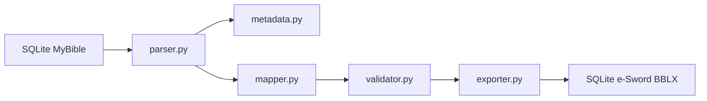

# Conversor Universal de Biblias MyBible a e-Sword BBLX

Herramienta en Python 3.12+ para inspeccionar módulos MyBible basados en SQLite, detectar su esquema automáticamente, normalizar metadata y exportar una base SQLite compatible con e-Sword (`.bblx`).

## Estado del proyecto

- Implementado para módulos bíblicos MyBible.
- Arquitectura lista para extender a comentarios, diccionarios y devocionales.
- Validaciones básicas incluidas.
- Exportación BBLX basada en SQLite con tablas `Details` y `Bible`.

## Diferencias de formato

### MyBible

Según la documentación pública y el análisis del código de referencia:

- usa SQLite;
- suele incluir `info`, `books` o `books_all`, y `verses`;
- guarda metadata como pares `name/value`;
- almacena el texto de los versículos en columnas de texto con marcado tipo HTML o tags propios;
- los nombres y algunos detalles del esquema pueden variar entre módulos y versiones.

### e-Sword BBLX

La documentación pública y ejemplos comunitarios indican que:

- también usa SQLite;
- requiere al menos `Details` y `Bible`;
- `Bible` almacena `Book`, `Chapter`, `Verse` y `Scripture`;
- `Scripture` suele contener RTF;
- la estructura mínima debe ser consistente para que e-Sword pueda abrir el archivo.

## Decisiones técnicas

1. **Inspección flexible de esquema**: no se asume un nombre único de tabla o columna.
2. **Normalización de texto**: se conserva Unicode, saltos de línea y formato básico.
3. **Salida RTF**: el exportador genera RTF mínimo compatible en `Scripture`.
4. **Validación no destructiva**: los problemas se registran, pero el flujo intenta continuar cuando es posible.

## Instalación

```bash
python3.12 -m venv .venv
source .venv/bin/activate
python -m pip install -U pip
python -m pip install -e .
python -m pip install pytest
```

## Uso

```bash
python convert.py entrada.SQLite3 salida.bblx
```

Opciones:

- `--verbose`
- `--debug`
- `--log ruta.log`
- `--force`
- `--output salida.bblx`
- `--metadata`
- `--validate`

### Ejemplos

```bash
python convert.py Biblia.SQLite3 salida.bblx --validate --verbose
python convert.py Biblia.SQLite3 --output salida.bblx --metadata
```

## Arquitectura



Componentes:

- `parser.py`: inspección de `sqlite_master`, tablas, índices y relaciones.
- `metadata.py`: inferencia y normalización de metadata.
- `mapper.py`: catálogo de libros y proyección a e-Sword.
- `mapper.py`: catálogo de libros y remapeo a la numeración de e-Sword.
- `validator.py`: duplicados, vacíos, huecos y anomalías.
- `exporter.py`: escritura del módulo `.bblx`.
- `cli.py`: interfaz de línea de comandos.

## Cómo agregar nuevos formatos

1. Crear un parser específico.
2. Normalizar los datos a `BibleModule`.
3. Reutilizar validación y exportación cuando aplique.
4. Agregar pruebas con bases SQLite de ejemplo.

## Cómo agregar nuevos tipos de módulos

La arquitectura ya separa:

- detección de módulo;
- extracción de datos;
- mapeo;
- exportación.

Para comentarios, diccionarios o devocionales:

1. ampliar `ModuleType`;
2. extender `inspect_schema`;
3. crear modelos y exportadores específicos;
4. añadir validación y tests.

## Flujo de conversión

1. Leer `sqlite_master`.
2. Detectar tablas/columnas compatibles.
3. Extraer metadata.
4. Leer libros y versículos.
5. Mapear libros al catálogo objetivo.
6. Validar duplicados y huecos.
7. Remapear los libros a la numeración de e-Sword.
8. Exportar a SQLite BBLX.

## FAQ

### ¿Convierte módulos oficiales cifrados de e-Sword?

No. Este proyecto genera módulos SQLite compatibles a partir de MyBible. Los módulos oficiales cifrados no son un objetivo.

### ¿Mantiene acentos y caracteres especiales?

Sí. El texto se maneja en Unicode y el exportador usa escapes RTF para preservar caracteres fuera de ASCII.

### ¿Está listo para otros tipos de módulos?

La arquitectura está preparada, pero la conversión completa de comentarios, diccionarios y devocionales aún no está implementada.

## Ejecución de tests

```bash
pytest
```
