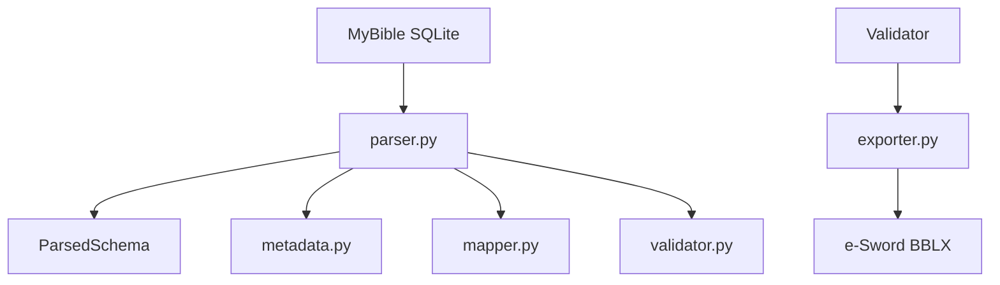

# Arquitectura

## Objetivos de diseño

- separar lectura, mapeo, validación y exportación;
- facilitar la extensión a otros tipos de módulos;
- mantener el código pequeño y testeable;
- registrar toda anomalía sin perder el flujo cuando sea posible.
